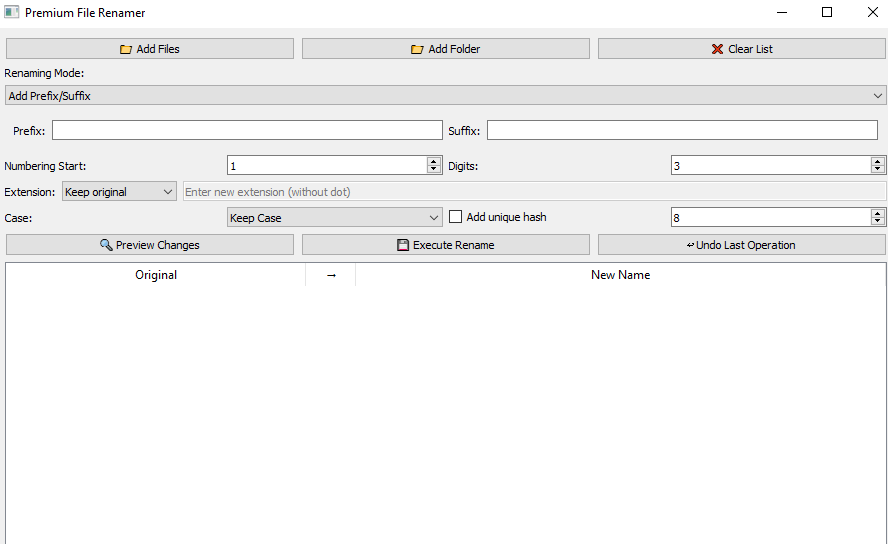

# Premium File Renamer Pro



The industry-leading bulk file renaming solution for professionals.  
**✓ Commercial-Grade** **✓ 100% Safe** **✓ Feature Complete**

---

## Table of Contents

- [Features](#features)
- [Quick Start](#quick-start)
  - [Installation](#installation)
  - [Usage](#usage)
- [Renaming Modes](#renaming-modes)
- [Advanced Options](#advanced-options)
- [Undo Functionality](#undo-functionality)
- [License](#license)
- [Contact](#contact)

---

## Features

| Feature                | Basic | Pro | Enterprise |
|------------------------|-------|-----|------------|
| Batch Renaming         | ✓     | ✓   | ✓          |
| EXIF Metadata          | ✗     | ✓   | ✓          |
| Undo Functionality     | ✗     | ✓   | ✓          |
| Priority Support       | ✗     | ✗   | ✓          |

---

## Quick Start

### Installation

To install Premium File Renamer Pro, use the following command:

```bash
pip install --user premium-file-renamer
```

### Usage

Run the application using the following command:

```bash
python main.py /path/to/folder
```

This will launch the graphical user interface (GUI) for renaming files.

---

## Renaming Modes

Premium File Renamer Pro supports the following renaming modes:

1. **Add Prefix/Suffix**  
   Add custom text before or after the file name.

2. **Complete Name Replacement**  
   Replace the entire file name with a new base name.

3. **Pattern-Based Naming**  
   Use patterns like `Photo_{num}_{date}` to rename files dynamically.

---

## Advanced Options

- **Numbering**: Start numbering from a specific value and define the number of digits (e.g., `001`, `002`).
- **Case Conversion**: Convert file names to lowercase, uppercase, or title case.
- **Extension Handling**: Keep the original extension, change it, or remove it entirely.
- **Unique Hash**: Add a unique hash to file names for better identification.

---

## Undo Functionality

Made a mistake? No problem! Premium File Renamer Pro allows you to undo the last renaming operation with a single click.

---

## License

This project is protected under a proprietary license.  
Unauthorized copying, distribution, or modification of this software is strictly prohibited.  
For more details, see the [LICENSE](../LICENSE.txt) file.

---

## Contact

For support or inquiries, contact us at:  
📧 **abbasdaughter18@gmail.com**

---

**Premium File Renamer Pro**  
⚡ Built with ❤️ by Dabeey